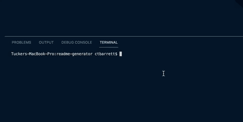

# README Generator

This is a tool to create a high quality README file based on user input, using Node.js and the Inquirer npm package.

## Table of Contents
  * [Technologies](#technologies)
  * [Functionality](#functionality)
  * [Challenges](#challenges)
  * [Contact](#contact)
  * [License](#license)

## Technologies
* JavaScript
* Node.js
* Inquirer npm package

## Functionality
[App Demonstration Video](https://youtu.be/qr-Uy0pvxJs)

#### App Initialization
- Be sure to first run <code>npm i</code> after cloning this repo or copying its code into your own files.
- Once the appropriate node modules have been installed, run <code>node index.js</code> to initialize the app:

## Challenges
- I couldn't format the text to be added to the generated README file as one normally would with JavaScript 
(by indenting lines within a function), because the indentations were read literally and translated to the README. 
To fix this, I simply aligned the entire string one indentation more to the left from what would be normal.

## Contact
* Email - ctbarrett.tech@gmail.com

## License
&copy; 2021 Charles Tucker Barrett

[MIT License](https://opensource.org/licenses/MIT)